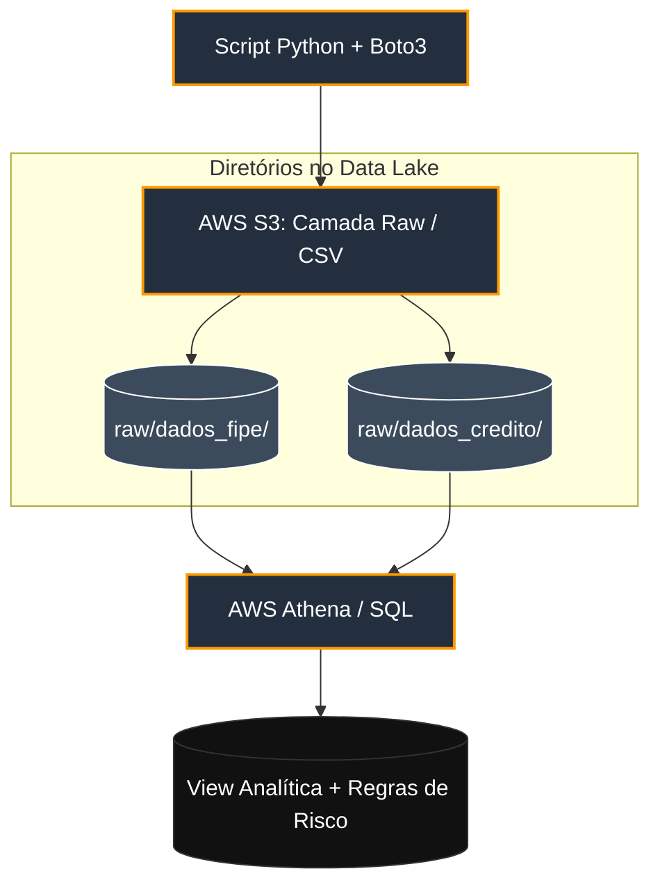

# AutoFinance Analytics Pipeline: Ingestão e Análise de Risco de Crédito em Nuvem

## 📌 Visão Geral do Projeto
Este projeto simula o core de uma operação de dados de uma fintech de financiamento automotivo. O objetivo foi criar um pipeline automatizado para ingerir dados volumosos de mercado (Tabela FIPE 2026) e cruzá-los com propostas de crédito simuladas de clientes para avaliar indicadores de risco, como o **LTV (Loan-to-Value)**, automatizando a tomada de decisão financeira.

## 🛠️ Arquitetura e Tecnologias
* **Linguagem:** Python
* **Automação de Infraestrutura e SDK:** Boto3
* **Armazenamento (Data Lake Camada Raw):** AWS S3
* **Motor de Consultas (Serverless Query Engine):** AWS Athena
* **Modelagem e Lógica de Negócio:** SQL Avançado

## 🚀 Como Funciona o Pipeline

### 1. Ingestão de Dados Automatizada (`upload_s3.py`)
Em vez de realizar uploads manuais via console web, utilizei a biblioteca `boto3` para integrar o script local diretamente com o ambiente de Nuvem AWS através de credenciais programáticas via AWS CLI. O script cria o bucket de forma dinâmica e organiza os arquivos em subpastas estruturadas que servem como nossa camada *Raw* do Data Lake.

### 2. Modelagem Serverless no AWS Athena
Com os arquivos estruturados no S3, mapeei os schemas das tabelas `dados_fipe` e `dados_credito` utilizando queries DDL externas. 

Para a inteligência de negócios, desenvolvi uma **VIEW analítica** responsável por realizar o tratamento de strings, remoção de espaços nulos (`TRIM`) e o cálculo de indicadores em tempo real:
* **Conversão monetária** (unidade em centavos para Real decimal).
* **Cálculo de LTV (Loan-to-Value)**: Métrica crucial que define a exposição de risco da fintech sobre o valor real do ativo sob garantia.

### 3. Motor de Decisão de Crédito (Engine SQL)
Utilizando estruturas condicionais (`CASE WHEN`), implementei uma query que simula a esteira de aprovação automatizada da fintech baseando-se na criticidade do risco (Score de Crédito vs LTV):
* **Aprovado - Taxa Premium:** Alto score e baixo LTV.
* **Análise Manual / Recusado:** Baixo score ou alta exposição do financiamento sobre o valor do veículo.

## 📈 Aprendizados e Desafios Superados
* **Resolução de Bugs de Cruzamento (Data Cleansing):** Durante o desenvolvimento do `JOIN`, identifiquei uma incompatibilidade de caracteres invisíveis que estava limpando os resultados. Corrigi o problema implementando funções de tratamento de strings diretamente na query do Athena.
* **Práticas de Segurança:** Configuração do AWS CLI utilizando o princípio do menor privilégio através de usuários programáticos gerenciados pelo IAM, evitando a exposição de chaves da conta raiz.
